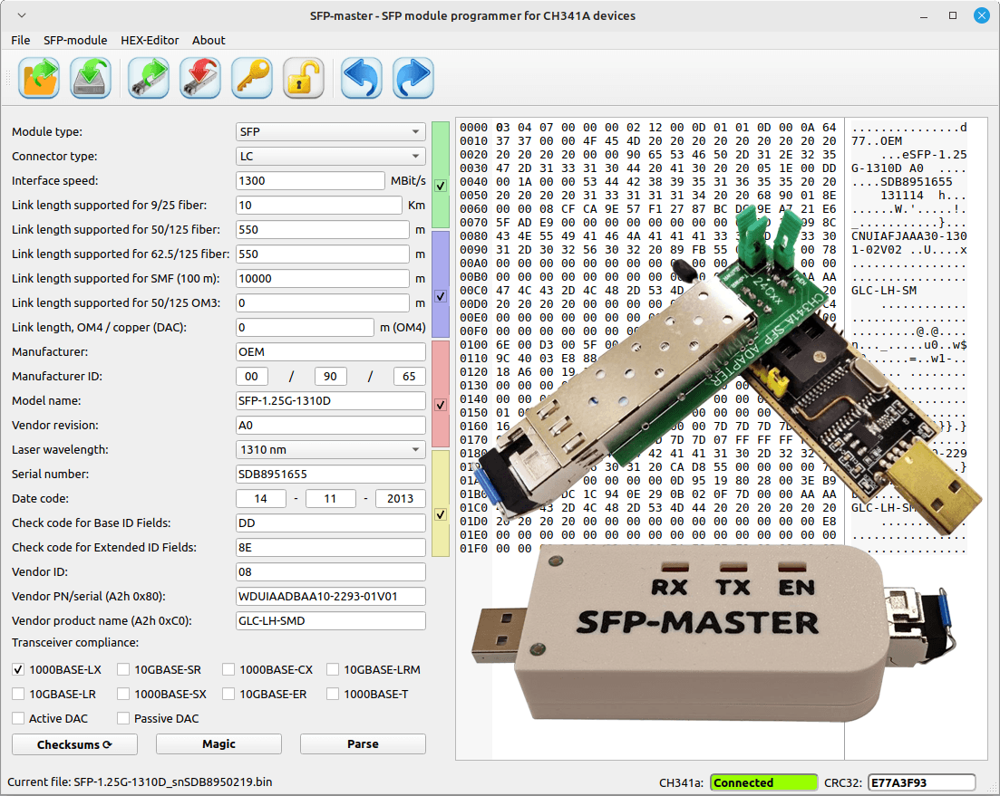
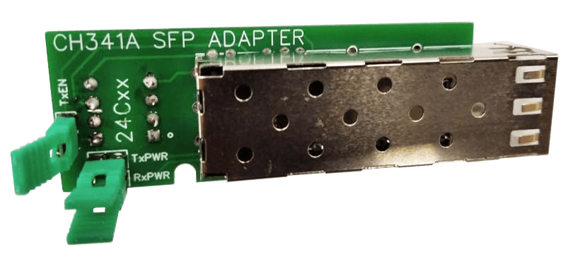
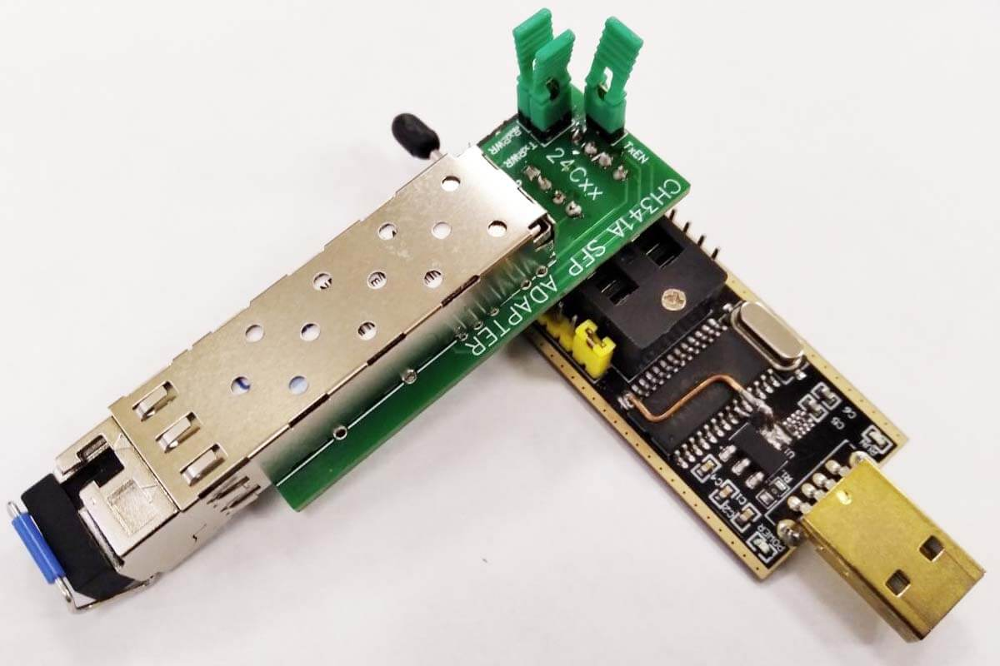
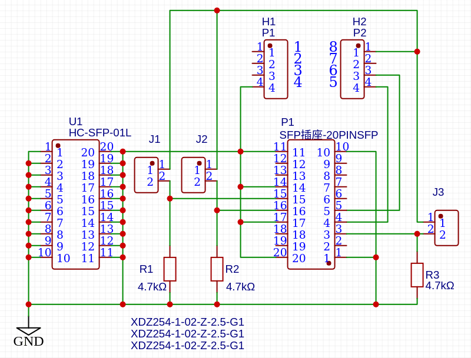
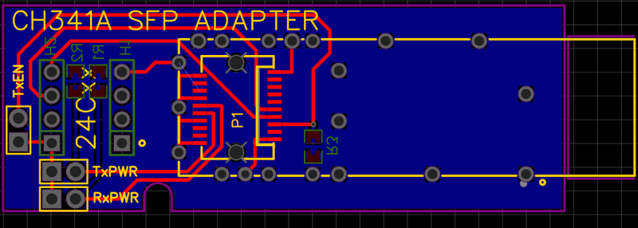
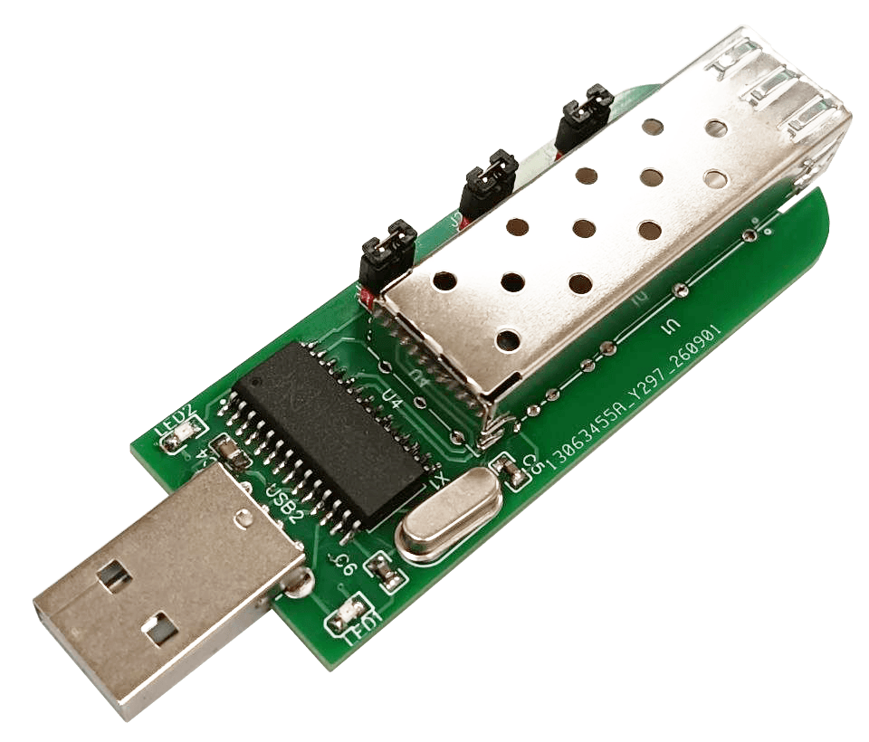

# SFP-Master-Hardware

**SFP-Master** is a free, cross-platform program for programming optical SFP modules. It allows you to read, write, and save SFP module data on a computer.
Software part of **SFP-Master** project is [here](https://github.com/bigbigmdm/SFP-Master). The description of the hardware is provided here.

The hardware part of SFP-Master can be assembling in two variants:
* [Adapter](#adapter) for very popular low cost CH341 programmer device.
* [SFP-Master device](#sfp-master-device)

## Adapter

This adapter must be connected to the section of the CH341 programmer's ZIF socket marked with the "24xx" symbols. At the same time, the ZIF socket lever must fit into the oval cutout on the adapter board.

### Schematic diagram

Jumpers J1 to J3 (TxPWR, RxPWR, TxEN) must be installed initially. They are used to supply power to the SFP module. If you want to program a module with hardware write protection, remove one of the jumpers and try to program the module. If it fails, remove the other jumper and repeat the operation.

Bill of material:

| ID  |  Name                | Footprint | Designator    | Quantity | LCSC link |
|:---:| :---                 | :---      | :---          |  :---:   |   :---:   |
|  1  |  P1                  | H1        | PZ254V-11-04P |     1    | [Link](https://www.lcsc.com/product-detail/C2691448.html?s_z=n_q_PZ-254V) |
|  2  |  P2                  | H2        | PZ254V-11-04P |     1    | [Link](https://www.lcsc.com/product-detail/C2691448.html?s_z=n_q_PZ-254V) |
|  3  | XDZ254-1-02-Z-2.5-G1 | J1,J2,J3  | PZ254V-11-02P |     3    | [Link](https://www.lcsc.com/product-detail/C492401.html?s_z=n_q_l_HDR-TH_4P-P2.54-V-M) |
|  4  | SFP插座-20PINSFP 	   | P1        | KSP20LG154    |     1    | [Link](https://www.lcsc.com/product-detail/C404108.html?s_z=n_q_t_SFP) |
|  5  | HC-SFP-01L           | U1        | HCSFP01       |     1    | [Link](https://www.lcsc.com/product-detail/C42418478.html?s_z=n_q_t_SFP) |
|  6  | 4.7kΩ	               | R1,R2,R3  | R0805         |     3    | [Link](https://www.lcsc.com/product-detail/C19696946.html?s_z=n_q_t_resistor%2520smd) |

### Printed circuit board

You can download the Gerber file to order this PCB [here](https://github.com/bigbigmdm/SFP-Master-Hardware/blob/main/gerber/Gerber_CH341A_SFP_ADAPTER_PCB_CH341A_SFP_ADAPTER_2024-11-22.zip).

You can see or downloading Kicad project by [Arend Jan Kramer](https://github.com/ArendJanKramer) [here](https://github.com/bigbigmdm/SFP-Master-Hardware/blob/main/kicad-adapter).

You can view this project in OSHWLab (EasyEDA) [here](https://oshwlab.com/einkreader/ch341a_sfp_adapter)

## SFP-master device

